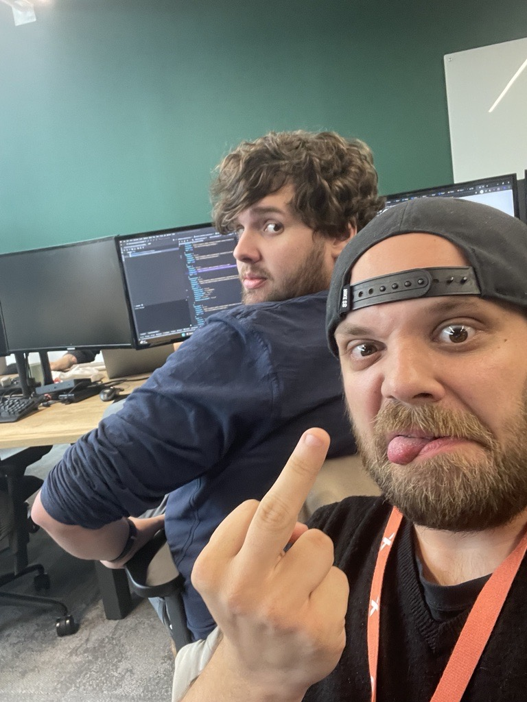

# Generate and improve code with Azure OpenAI Service

::: secondary
The Azure OpenAI Service models can generate code for you using natural language prompts, fixing bugs in completed code, and providing code comments. These models can also explain and simplify existing code to help you understand what it does and how to improve it.
:::

## Provision an Azure OpenAI resource

::: secondary
If you don't already have one, provision an Azure OpenAI resource in your Azure subscription.
:::
1. [ ] Sign into the **Azure portal** using your credentials.
2. [ ] Create an **Azure OpenAI** resource with the following settings:

    - **Subscription**: Select your subscription

    - **Resource group**: Select your resource group
    - **Region**: East US
    - **Name**: *A unique name of your choice*
    - **Pricing tier**: Standard S0

     \* Azure OpenAI resources are constrained by regional quotas. Randomly choosing a region reduces the risk of a single region reaching its quota limit in scenarios where you are sharing a subscription with other users. In the event of a quota limit being reached later in the exercise, there's a possibility you may need to create another resource in a different region.

3. [ ] Wait for deployment to complete. Then go to the deployed Azure OpenAI resource in the Azure portal.

## Deploy a model

::: secondary
Azure OpenAI provides a web-based portal named **Azure OpenAI Studio**, that you can use to deploy, manage, and explore models. You'll start your exploration of Azure OpenAI by using Azure OpenAI Studio to deploy a model.
:::

1. [ ] On the **Overview** page for your Azure OpenAI resource, use the **Go to Azure OpenAI Studio** button to open Azure OpenAI Studio in a new browser tab.
2. [ ] In Azure OpenAI Studio, on the **Deployments** page, view your existing model deployments. If you don't already have one, create a new deployment of the **gpt-35-turbo-16k** model with the following settings:

    - **Model**: gpt-35-turbo-16k *(if the 16k model isn't available, choose gpt-35-turbo)*

    - **Model version**: Auto-update to default
    - **Deployment name**: *A unique name of your choice*

    - **Advanced options**

        - **Content filter**: Default

        - **Tokens per minute rate limit**: 5K\*
        - **Enable dynamic quota**: Enabled

     \* A rate limit of 5,000 tokens per minute is more than adequate to complete this exercise while leaving capacity for other people using the same subscription.

## Generate code in chat playground

::: secondary
Before using in your app, examine how Azure OpenAI can generate and explain code in the chat playground.
:::

1. [ ] In [**Azure OpenAI Studio** !!https://oai.azure.com!!, in the **Playground** section, select the **Chat** page. The **Chat** playground page consists of three main sections:

    - **Assistant setup** - used to set the context for the model's responses.

    - **Chat session** - used to submit chat messages and view responses.
    - **Configuration** - used to configure settings for the model deployment.

2. [ ] In the **Configuration** section, ensure that your model deployment is selected.
3. [ ] In the **Assistant setup** area, set the system message to !!You are a programming assistant helping write code!! and save the changes.
4. [ ] In the **Chat session**, submit the following query:

    ```
    Write a function in python that takes a character and a string as input, and returns how many times the character appears in the string
    ```

    The model will likely respond with a function, with some explanation of what the function does and how to call it.

5. [ ] Next, send the prompt !!Do the same thing, but this time write it in C#!!.

    The model likely responded very similarly as the first time, but this time coding in C#. You can ask it again for a different language of your choice, or a function to complete a different task such as reversing the input string.

6. [ ] Next, let's explore using AI to understand code. Submit the following prompt as the user message.

    ```
    What does the following function do?  
    ---  
    def multiply(a, b):  
        result = 0  
        negative = False  
        if a < 0 and b > 0:  
            a = -a  
            negative = True  
        elif a > 0 and b < 0:  
            b = -b  
            negative = True  
        elif a < 0 and b < 0:  
            a = -a  
            b = -b  
        while b > 0:  
            result += a  
            b -= 1      
        if negative:  
            return -result  
        else:  
            return result  
    ```




